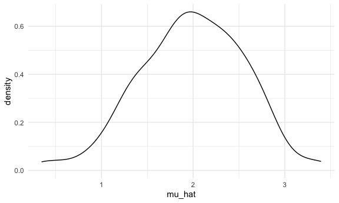
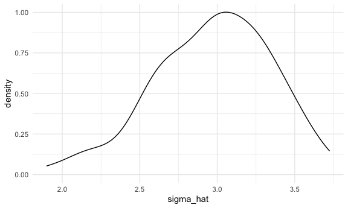

Simulation
================

``` r
library(tidyverse)
```

    ## ── Attaching packages ─────────────────────────────────────── tidyverse 1.3.1 ──

    ## ✓ ggplot2 3.3.5     ✓ purrr   0.3.4
    ## ✓ tibble  3.1.2     ✓ dplyr   1.0.7
    ## ✓ tidyr   1.1.3     ✓ stringr 1.4.0
    ## ✓ readr   1.4.0     ✓ forcats 0.5.1

    ## ── Conflicts ────────────────────────────────────────── tidyverse_conflicts() ──
    ## x dplyr::filter() masks stats::filter()
    ## x dplyr::lag()    masks stats::lag()

``` r
set.seed(1)

knitr::opts_chunk$set(
  fig.width = 6,
  fig.asp = 0.6,
  out.width = "90%")


theme_set(theme_minimal() + theme(legend.position = "bottom"))

options(
  ggplot2.continuous.colour = "viridis" ,
  ggplot2.continuous.fill = "viridis"
)

scale_colour_discrete = scale_colour_viridis_d
scale_fill_discrete = scale_fill_viridis_d
```

## Let’s simulate something

I have a function:

``` r
sim_mean_sd = function(n, mu = 2, sigma = 3) {
  
  sim_data = tibble(
    x = rnorm(n, mean = mu, sd = sigma),
  )
  
  sim_data %>% 
    summarize(
      mu_hat = mean(x),
      sigma_hat = sd(x)
    )
}
```

I can “simulate” by running this line:

``` r
sim_mean_sd(30)
```

    ## # A tibble: 1 x 2
    ##   mu_hat sigma_hat
    ##    <dbl>     <dbl>
    ## 1   2.25      2.77

## Let’s simulate a lot

Let’s start with a for loop.

``` r
output = vector("list", length = 100)

for (i in 1:100) {
  
  output[[i]] = sim_mean_sd(n = 30)
  
}

bind_rows(output)
```

    ## # A tibble: 100 x 2
    ##    mu_hat sigma_hat
    ##     <dbl>     <dbl>
    ##  1   2.40      2.39
    ##  2   2.33      2.88
    ##  3   2.34      2.65
    ##  4   1.01      2.77
    ##  5   2.71      3.17
    ##  6   2.20      3.25
    ##  7   1.29      3.04
    ##  8   2.07      2.79
    ##  9   2.41      3.09
    ## 10   2.65      2.84
    ## # … with 90 more rows

Let’s use a loop function.

``` r
sim_results =
rerun(100, sim_mean_sd(n = 30)) %>% 
  bind_rows()
```

Let’s look at results…

``` r
sim_results %>% 
ggplot(aes(x = mu_hat)) + geom_density()
```



``` r
sim_results %>% 
summarize (
  avg_samp_mean = mean(mu_hat),
  sd_samp_mean = sd (sigma_hat)
)
```

    ## # A tibble: 1 x 2
    ##   avg_samp_mean sd_samp_mean
    ##           <dbl>        <dbl>
    ## 1          1.99        0.375

``` r
sim_results %>% 
ggplot(aes(x = sigma_hat)) + geom_density()
```


